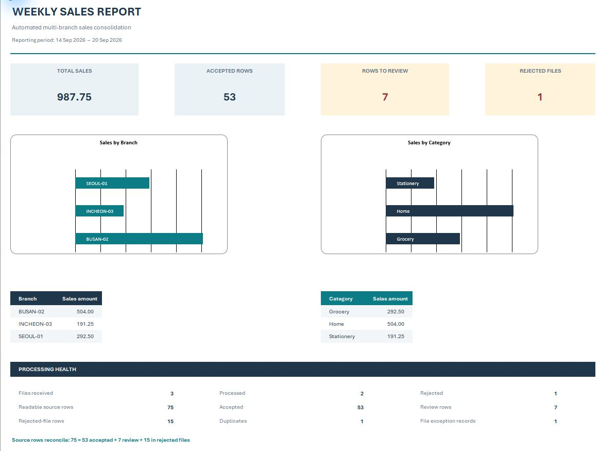
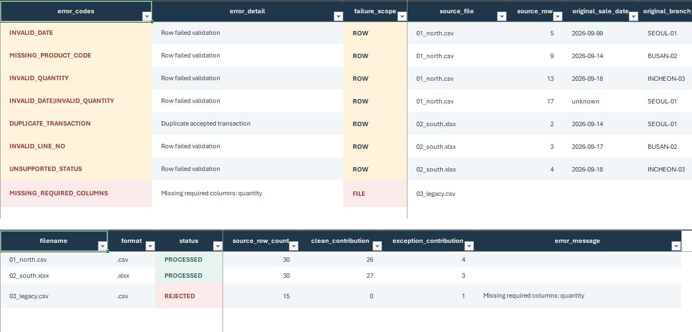

# Weekly Sales Report Automation

Turn a week's branch sales files into one Excel report that shows both the sales result and the records needing attention.



## The problem

A small multi-branch business may receive separate CSV and XLSX exports every week. Preparing a report by hand means combining files, checking invalid rows and duplicate transactions, excluding unreliable data from totals, and rebuilding branch and category summaries. **This is a portfolio case study with fictional sample data**, based on a realistic recurring spreadsheet workflow. The example models work that could otherwise take roughly 1–2 hours manually; no client time saving was measured.

## The workflow

Branch CSV/XLSX files → validation → duplicate checks → accepted rows and exceptions → summaries → Excel workbook.

For the recipient: place this week's files in `input` → double-click `Weekly Sales Report.exe` → open `output/weekly_sales_report.xlsx`. The source files stay untouched. Valid files can continue when another file is rejected.

## What the report gives you

| Sheet | Why it matters |
| --- | --- |
| **Summary** | Sales total, branch and category charts, review counts, and processing health. |
| **Clean_Data** | Accepted rows with normalized values and their source file and row. |
| **Exceptions** | Row or file problems, reasons, scope, and available original values. |
| **Run_Info** | One status record per discovered file, including its contribution or rejection reason. |



## Example result

The [inspectable demo workbook](docs/demo/weekly_sales_report_demo.xlsx) was generated from the three fictional files in `sample_data/input`: **75 readable source rows → 53 accepted + 7 row-level review items + 15 rows excluded with one rejected file**. The report identifies **1 duplicate** and totals accepted sales at **987.75**. The row accounting reconciles: **75 = 53 + 7 + 15**. A rejected file produces one file-level exception record; its 15 rows are counted separately from the seven row-level items.

## Reliability built in

- Inputs are read without modification; accepted rows retain source file and row provenance.
- File order and the first valid occurrence of a transaction determine duplicate handling. Later copies, including conflicts, remain visible in Exceptions.
- A malformed file can be isolated while valid files continue, and rejected files remain visible in Run_Info.
- The workbook is written to a temporary file and replaced atomically. If replacement fails, the previous valid report remains.
- Excel lock files are ignored. UTF-8, UTF-8 with BOM, and CP949 CSV files are supported. Formula-like customer text is stored as literal text.

## Windows delivery

The portable ZIP contains `input`, `output`, `examples`, instructions, `Weekly Sales Report.exe`, and its `_internal` runtime. Keep the **entire folder** together. The recipient does not need Python. This is an unsigned portable build, so an organization's security policy may block or warn about it. A package can be built for delivery; no EXE or ZIP is stored in this repository.

## Validation evidence

**22 automated tests pass** on this checkpoint. They cover row and file validation, duplicates, source byte preservation, repeat runs, mixed valid and malformed input, no input, locked output, and safe failure messages. An Excel-saved fixture tests styled blank residue. The demo workbook was opened in Microsoft Excel; its charts and sheets rendered without a repair prompt. Earlier Windows delivery validation launched the packaged EXE outside the repository, with the Python environment neutralized to check the bundled `_internal` runtime, and checked input SHA-256 preservation. See [validation details](docs/VALIDATION.md) and the [case study](docs/CASE_STUDY.md). This evidence describes the demonstrated workflow, not production readiness for arbitrary client files.

## Tech

Python · openpyxl · PyInstaller · pytest · PowerShell

## Limitations and adaptation points

Customer column schemas need adaptation when they differ. The demo assumes `(order_id, line_no)` identifies a transaction and that `order_id` is unique across branches; a client's correction or re-export rule must be agreed. Only the first XLSX worksheet is read. CSV support is UTF-8, UTF-8 with BOM, or CP949. `.xls`, `.xlsm`, and `.xlsb` are surfaced as unsupported, not processed. Refunds, cancellations, taxes, currency, high-precision amounts, and accounting treatment need client-specific rules. The unsigned EXE may face Windows security-policy friction. See [input requirements](INPUT_REQUIREMENTS.txt) for the exact demo contract.

## Run from source

From the repository root on Windows (Python 3.10+):

```powershell
py -3.12 -m venv .venv
.\.venv\Scripts\python.exe -m pip install -e ".[test]"
.\.venv\Scripts\python.exe scripts\generate_sample_data.py
.\.venv\Scripts\python.exe -m weekly_sales_report --input sample_data\input --output sample_data\output\weekly_sales_report.xlsx
.\.venv\Scripts\python.exe -m pytest
```

## Build the Windows package

From the repository root on Windows:

```powershell
.\.venv\Scripts\python.exe -m pip install -e ".[test,build]"
.\scripts\build_windows.ps1
```

The script creates `dist\Weekly Sales Report\` and `dist\WeeklySalesReport.zip`. Deliver the ZIP or the whole folder, including `_internal`.
